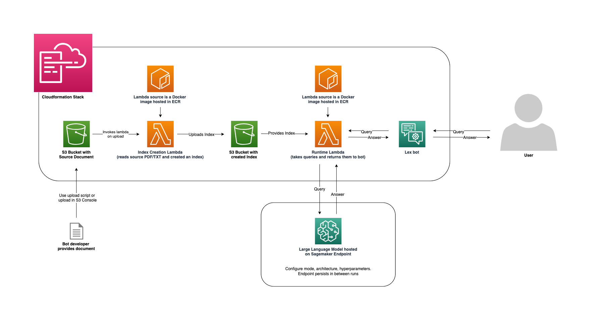

# AWS Lex Conversational FAQ Demo

Demonstration of LLM integration into a lex bot using Lambda codehooks and a Sagemaker endpoint.



### What resources will be created?
This CDK code will create the following:
   - 1 Sagemaker endpoint hosting a model (default configuration is falcon-7b-instruct on ml.g5.8xlarge but you can configure model or hardware)
   - 1 Lex bot
   - 2 S3 buckets (one for your uploaded source, one for the created index)
   - 2 Lambda functions (one to ingest the source and create an image, one to be invoked as codehook during lambda and provide an FAQ answer when needed)
   - 1 Event listener attached to an S3 bucket to call the index creation lambda automatically when a file is uploaded
   - 2 Iam roles (one for the lex bot to call lambda, one for the lambdas to call sagemaker and S3)

## Requirements

### AWS setup
**Region**

If you have not yet run `aws configure` and set a default region, you must do so, or you can also run `export AWS_DEFAULT_REGION=<your-region>` 

**Authorization**

You must use a role that has sufficient permissions to create Iam roles, as well as cloudformation resources

#### Python >=3.7
Make sure you have [python3](https://www.python.org/downloads/) installed at a version >=3.7.x

#### Docker
Make sure you have [Docker](https://www.docker.com/products/docker-desktop/) installed on your machine and running in the background 

#### AWS CDK
Make sure you have the [AWS CDK](https://docs.aws.amazon.com/cdk/v2/guide/getting_started.html#getting_started_install) installed on your machine


## Setup

### Set up virtual enviroment and gather packages

```
cd src/lex-gen-ai-demo-cdk-files
```

Install the required dependencies (aws-cdk-lib and constructs) into your Python environment 
```
pip install -r requirements.txt
```

### Gather and deploy resources with the CDK

First synthesize, which executes the application, defines which resources will be created, and translates this into a cloudformation template
```
cdk synth
```
Now bootstrap, which provisions the resources you'll use when deploying the application
```
cdk bootstrap
```
and deploy with
```
cdk deploy LexGenAIDemoFilesStack
```

The deployment will create a lex bot and S3 buckets and will dockerize the code in the `lex-gen-ai-demo-cdk/index-creation-docker-image` and `lex-gen-ai-demo-cdk/lex-gen-ai-demo-docker-image` directory and push that image to ECR so it can run in Lambda. Don't worry if this step takes a long time while pushing to ECR, we are bundling up two docker images and uploading them so it will take some time.

## Usage
Once all the resources are created after `cdk deploy` finishes running you must upload a .pdf or .txt file at least once so an index can be created. You can use our upload script `upload_file_to_s3.py path/to/your/file` or you can navigate to the S3 console and manually upload a file. On upload the ingestion lambda will read the file and create an embedding which it will upload to the other S3 bucket. Now that an embedding exists you can go to your bot and begin using it. If you want to update the embedding you can upload a new file and a new embedding will overwrite the old embedding. Once you have a new embedding you must restart the runtime lambda function for it to start using the new embedding. 

Note, the first time the embedding lambda and the runtime lambda are called the latency will be much slower as it must load resources and save them in the lambda enviroment. Once loaded these resources will stay in the enviroment as long as the ECR image is not deleted. This means your first request will be slow but after that it will be faster now that the resources are cached.

### Uploading files 
Now, you have to upload your source file so the indexing lambda can create an index for the runtime lambda to use. You can use our script with any .pdf or .txt file by running
```
python3 upload_file_to_s3.py path/to/your/file
```
or you can open the S3 bucket in the console and manually upload a file. On upload an index will automatically be generated.
Note: If you upload a large file, the index will be large and the S3 read time on cold start may become large.

Once you've uploaded your file, wait a little for your index to be created and then you can go into the Lex console and test your bot (no need to build your bot unless you've made changes after creation). The first time you create an index and the first time you query the bot it will take a little longer (around 90 seconds) as we need to load models and cache them in the lambda-ECR enviroment, but once they are cached there is no need to download them and latency will be much faster. These resources will remain cached as long as the ECR image is not deleted. Additionally for better cold start performance you can provision an instance for your runtime lambda function. There are directions to do so below.

### Configurations

🚨 **Remember to shut down your endpoint if you're done using it!** 🚨

We have provided a script to deactivate an endpoint and endpoint configuration with whatever name is in the endpoint creation script. To run:
```
python3 shut_down_endpoint.py
```

#### Custom model and instance type configuration:

The function `create_endpoint_from_HF_image()` is called in `app.py`. This function accepts the following arguments:
 - hf_model_id (required): For the purposes of the demo we have this set to [tiiuae/falcon-7b-instruct](https://huggingface.co/tiiuae/falcon-7b). You can find any model on https://huggingface.co/ and feed it in
 - instance_type (optional, default is ml.g5.8xlarge): If you don't give an argument we'll use ml.g5.8xlarge. You can use any endpoint [sage instance type](https://aws.amazon.com/sagemaker/pricing/)
 - endpoint_name (optional, default is whatever SAGEMAKER_ENDPOINT_NAME is set to in the file endpoint_handler.py): You can give your endpoint a custom name. It is recomended that you don't do this but if you do, you have to change it in the lamdba images (constant is called ENDPOINT_NAME in index_creation_app.py and runtime_lambda_app.py)
 - number_of_gpu (optional, default is 1): Set this to any number of GPUs the hardware you chose allows. 

 If you have in invalid configuration the endpoint will fail to create. You can see the specific error in the cloudwatch logs. If you fail creation you can run `python3 shut_down_endpoint.py` to clean up the endpoint but if you do so manually in the console **you must delete both the endpoint and the endpoint configuration**

#### Further configuration
If you would like to further configure the endpoint you can change the specific code in `endpoint_handler.py`

The LLM is hosted on a sagemaker endpoint and deployed as a sagemaker [ceModel](https://sagemaker.readthedocs.io/en/stable/frameworks/ce/sagemaker.ce.html). We are also using a ce model image. You can read more about it [here](https://aws.amazon.com/blogs/machine-learning/announcing-the-launch-of-new-hugging-face-llm-inference-containers-on-amazon-sagemaker/). For further model configuration you can read about sagemaker model deployments [here](https://docs.aws.amazon.com/sagemaker/latest/dg/realtime-endpoints-deployment.html).

For our indexing and retrieval we are using [llama-index](https://github.com/jerryjliu/llama_index). If you would like to configure the index retriever you can do so in the `runtime_lambda_app.py` file in the `VectorIndexRetriever` object on line 70. If you want to update index creation you can update the constants defined at the top of the index creation and runtime lambdas (`index_creation_app.py` and `runtime_lambda_app.py`). Make sure to familiarize yourself with [llama-index terms](https://gpt-index.readthedocs.io/en/latest/guides/tutorials/terms_definitions_tutorial.html) and the [llama-index prompthelper](https://gpt-index.readthedocs.io/en/latest/reference/service_context/prompt_helper.html) for best results.

### Tips for best results

**Keep your lambda perpetually warm by provisioning an instance for the runtime lambda (lex-codehook-fn)**

Go to Lambda console > select the function lex-codehook-fn

Versions > Publish new version

Under this version 
   - Provisioned Concurrency > set value to 1
   - Permissions > Resource based policy statements > Add Permissions > AWS Service > Other, your-policy-name, lexv2.amazonaws.com, your-lambda-arn, lamdba:InvokeFunction

Go to your Lex Bot (LexGenAIDemoBotCfn)

Aliases > your-alias > your-language > change lambda function version or alias > change to your-version

This will keep an instance running at all times and keep your lambda ready so that you won't have cold start latency. This will cost a bit extra (https://aws.amazon.com/lambda/pricing/) so use thoughtfully. 
